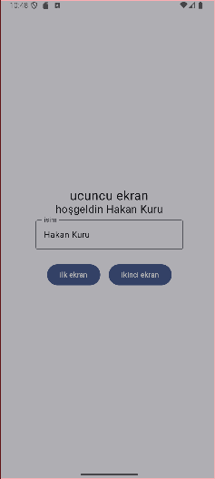

# **NavigationSample**

Bu proje, Android Jetpack Compose kullanarak ekranlar arasında gezinme ve veri paylaşımı için örnek bir uygulamadır. `ViewModel` ile ekranlar arasında veri paylaşımı yapılır ve Jetpack Navigation Compose ile gezinme yönetilir.

---

## **Uygulama Yapısı**

### **Dosya Açıklamaları**
- **MainActivity.kt**: Uygulama giriş noktası. Navigation ve ViewModel'in bağlandığı alan.
- **FirstScreen.kt**: İlk ekranın arayüzü.
- **SecondScreen.kt**: İkinci ekranın arayüzü.
- **ThirdScreen.kt**: Üçüncü ekranın arayüzü.
- **SharedViewModel.kt**: Ekranlar arasında veri paylaşımını sağlayan `ViewModel`.

---

## **Ekran Görüntüleri**
Uygulamanın çalışma şeklini göstermek için ekran görüntüleri eklenebilir. Aşağıdaki başlıklar altında ekran görüntülerinizi yerleştirin:


### **İlk Ekran (FirstScreen)**
Kullanıcıdan isim girmesi istenir:  


### **İkinci Ekran (SecondScreen)**
Kullanıcı adı gösterilir ve diğer ekranlara geçiş yapılabilir:  


### **Üçüncü Ekran (ThirdScreen)**
Kullanıcı bilgisi tekrar gösterilir ve diğer ekranlara geçiş yapılabilir:  


---

## **Kullanılan Teknolojiler**
- **Kotlin**: Uygulama yazılım dili.
- **Jetpack Compose**: Arayüz geliştirme kütüphanesi.
- **Android ViewModel**: Veri yönetimi ve yaşam döngüsü bileşeni.
- **Navigation Compose**: Ekranlar arasında kolay gezinme sağlamak için kullanılan kütüphane.

---

## **Geliştirici Notları**
- **SharedViewModel** sayesinde tüm ekranlarda ortak bir veri havuzu kullanılır.  
- Daha fazla ekran eklemek için `NavHost`'a yeni bir `composable` eklemeniz yeterlidir.  
- Her ekran için bağımsız `Preview` fonksiyonları tanımlanmıştır.  

**Hata Çözümü:**  
- Eğer `ViewModel`'i `composable` içinde tanıyamıyorsanız, `@Composable` fonksiyonlar arasındaki veri paylaşımına dikkat edin.

---

## **Başlatma**

### Gereksinimler:
- Android Studio Bumblebee veya daha yeni bir sürüm.
- Minimum Android SDK 21.

### Çalıştırmak için:
1. Bu repository’yi klonlayın:  
   ```bash
   git clone https://github.com/username/NavigationSample.git
   cd NavigationSample
